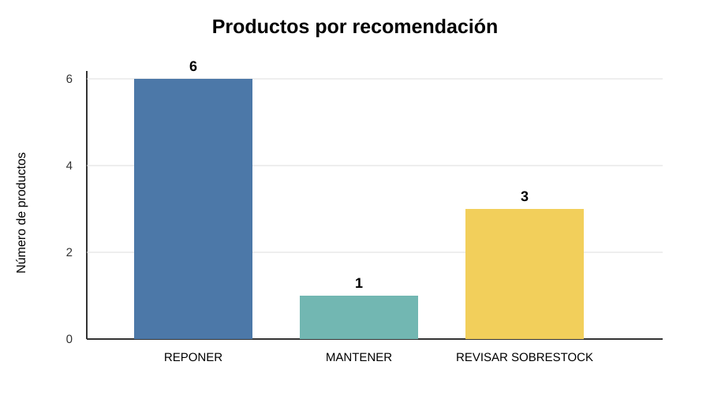
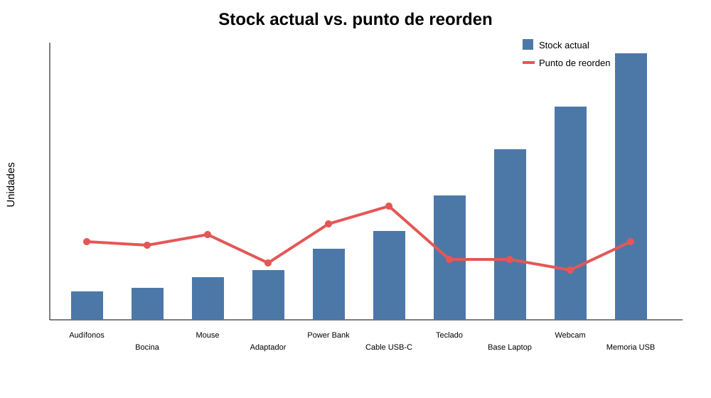

# Analítica prescriptiva aplicada a inventarios

Proyecto académico de Fundamentos de Big Data enfocado en utilizar datos de ventas e inventario para apoyar decisiones de reposición.

## Objetivo

El objetivo del proyecto es pasar de datos de inventario a una recomendación concreta. A partir del stock disponible, las ventas recientes, el stock mínimo y el tiempo de reposición, el programa calcula indicadores y clasifica cada producto en una de tres acciones:

- **REPONER:** el stock llegó o bajó del punto de reorden.
- **MANTENER:** el inventario se encuentra en un rango adecuado.
- **REVISAR SOBRESTOCK:** existe una cantidad alta de producto respecto a la demanda y al nivel objetivo.

La idea principal del flujo es:

**Datos → Limpieza → Análisis → Recomendación → Acción**

## ¿Por qué es analítica prescriptiva?

La analítica descriptiva ayuda a entender qué pasó y la predictiva busca estimar qué podría pasar. En este proyecto se utiliza analítica prescriptiva porque el resultado final propone **qué acción tomar** con cada producto.

No solamente se muestran ventas o existencias: el sistema usa esos datos para recomendar una decisión de inventario.

## Datos utilizados

El archivo principal es `data/inventario.csv`. Para cada producto se consideran:

| Dato | Uso |
|---|---|
| producto | Identifica el artículo |
| stock_actual | Unidades disponibles |
| ventas_ultimos_30_dias | Permite estimar la demanda diaria |
| stock_minimo | Reserva de seguridad |
| tiempo_reposicion_dias | Días que tarda en llegar un nuevo pedido |

Se conservan 10 productos en el archivo principal porque permiten revisar manualmente los cálculos durante la exposición. También se incluye un generador de datos sintéticos para probar la misma lógica con 100,000 registros o más.

## Cálculos principales

**Demanda diaria**

```text
demanda_diaria = ventas_ultimos_30_dias / 30
```

**Demanda durante el tiempo de reposición**

```text
demanda_reposicion = demanda_diaria × tiempo_reposicion_dias
```

**Punto de reorden**

```text
punto_reorden = demanda_reposicion + stock_minimo
```

El `stock_minimo` se utiliza como stock de seguridad.

**Nivel objetivo**

```text
nivel_objetivo =
stock_minimo +
demanda_diaria × (tiempo_reposicion_dias + 7)
```

Los 7 días son una semana adicional de cobertura. Esta cantidad está definida en `DIAS_COBERTURA_EXTRA`, por lo que puede cambiarse según la política de inventario.

Si es necesario reponer:

```text
cantidad_sugerida = nivel_objetivo - stock_actual
```

En una versión inicial se había considerado utilizar un porcentaje fijo para calcular la reposición. Se sustituyó por esta política porque así la cantidad recomendada depende directamente de la demanda, el tiempo de entrega y el stock de seguridad.

## Calidad de los datos

Antes de hacer los cálculos, el programa revisa:

- columnas obligatorias;
- valores nulos;
- productos duplicados;
- valores numéricos inválidos;
- inventarios o ventas negativas;
- tiempos de reposición menores o iguales a cero.

La calidad de los datos es importante porque una recomendación calculada con información incorrecta también puede ser incorrecta.

## Resultados del ejemplo

Con los 10 productos del archivo `inventario.csv`, el resultado actual es:

| Recomendación | Productos |
|---|---:|
| REPONER | 6 |
| MANTENER | 1 |
| REVISAR SOBRESTOCK | 3 |

El detalle completo queda guardado en `docs/evidencias/resultado_recomendaciones.csv`.

### Productos por recomendación



### Stock actual contra punto de reorden



## Relación con Big Data: las 5 V

**Volumen.** El generador `src/generar_dataset.py` permite crear 100,000 registros o más para probar el proceso con un conjunto mayor.

**Velocidad.** El proyecto genera eventos de venta en JSONL para representar información que en un sistema real podría llegar continuamente desde una tienda física, una app o comercio electrónico.

**Variedad.** Se manejan datos en CSV y JSONL. En un caso real también podrían integrarse bases de datos, APIs o información de proveedores.

**Veracidad.** Antes de analizar se validan nulos, duplicados, columnas y valores inválidos.

**Valor.** El resultado no se queda en almacenar datos: los convierte en recomendaciones útiles para decidir qué hacer con el inventario.

El proyecto es una demostración académica. Tener muchos registros no convierte por sí solo una computadora en una plataforma Big Data distribuida. La intención es demostrar el flujo y cómo podría escalar.

## Arquitectura

```text
Fuentes de datos
      ↓
Extracción
      ↓
Validación y limpieza
      ↓
Transformación
      ↓
Cálculo de indicadores
      ↓
Motor prescriptivo
      ↓
REPONER / MANTENER / REVISAR SOBRESTOCK
      ↓
CSV + gráficas + decisión
```

Para archivos más grandes se incluye `src/procesar_por_chunks.py`, que procesa la información por bloques. En una implementación empresarial, la misma lógica podría migrarse a almacenamiento distribuido y herramientas como Apache Spark.

La explicación completa se encuentra en `docs/arquitectura.md`, `docs/metodologia.md` y `docs/5v_big_data.md`.

## Estructura

```text
analitica-prescriptiva-big-data/
├── README.md
├── requirements.txt
├── data/
│   ├── inventario.csv
│   └── README.md
├── src/
│   ├── main.py
│   ├── generar_dataset.py
│   └── procesar_por_chunks.py
└── docs/
    ├── arquitectura.md
    ├── metodologia.md
    ├── 5v_big_data.md
    ├── referencias.md
    └── evidencias/
        ├── resultado_recomendaciones.csv
        ├── grafica_recomendaciones.svg
        └── grafica_stock_vs_reorden.svg
```

## Instalación y ejecución

Se requiere Python 3.10 o superior.

```bash
git clone https://github.com/diegoponchotrejo-png/analitica-prescriptiva-big-data.git
cd analitica-prescriptiva-big-data
pip install -r requirements.txt
python src/main.py
```

Al terminar, el programa guarda el CSV de resultados y las gráficas dentro de `docs/evidencias/`.

Para generar un conjunto mayor:

```bash
python src/generar_dataset.py --registros 100000 --eventos 20000
python src/main.py --data data/inventario_sintetico.csv
```

Para procesarlo por bloques:

```bash
python src/procesar_por_chunks.py --data data/inventario_sintetico.csv --chunk 20000
```

## Limitaciones

Este proyecto funciona como prototipo académico. La demanda se estima mediante un promedio simple y no se consideran factores como temporadas, promociones, costos de pedido, capacidad de almacén o restricciones específicas de proveedores. El dataset grande es sintético y el procesamiento por chunks no sustituye una infraestructura distribuida real.

## Conclusión

Con este proyecto comprobamos que los datos pueden utilizarse no solamente para conocer el estado del inventario, sino también para apoyar una decisión. A partir de información sencilla de ventas y existencias calculamos el punto de reorden y un nivel objetivo, y con ellos generamos una recomendación para cada producto. La parte más importante es que el resultado termina en una acción entendible: reponer, mantener o revisar un posible sobrestock.

## Integrantes

- Diego Alfonso Trejo Arellano
- Franko Ignacio del Toro Fernández
